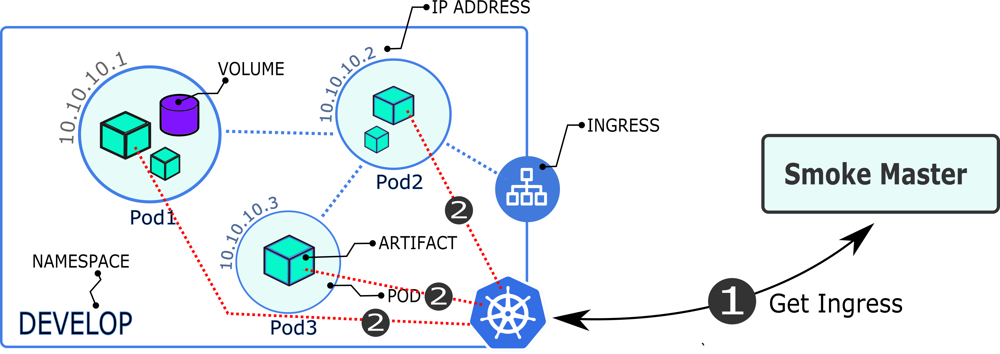
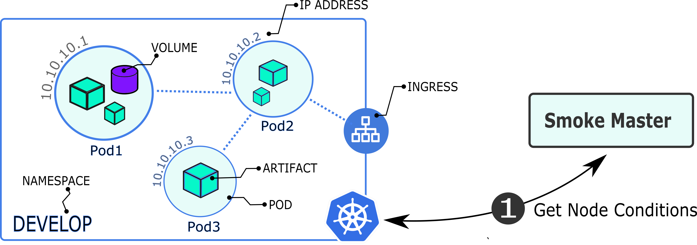
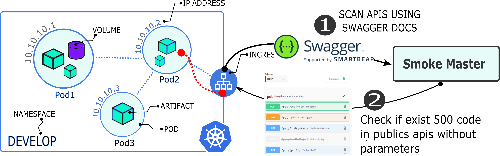
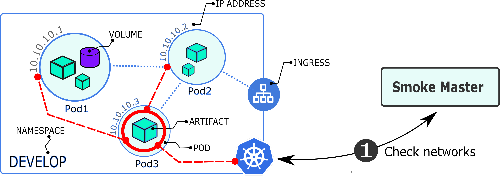

# 💨🔥💨  KubeSmokeTest (create-smktest)

https://www.youtube.com/watch?v=wStqZmIPJM4

#### ✅ Kubernetes, ✅ Automatic test generator, ✅ Smoke Test, ✅  Ephemeral service

This library can be used to generate automated smoke tests using Kubernetes. It is an excellent option to avoid spurious failures and avoid wasting time debugging errors in your projects instead of looking for the error in the cluster.
The characteristics of the smoke tests are to be fast and require no maintenance.

Click on the image to see the video:

## Table of Contents

- [Criteria use](#criteria-use)
    - [Cluster Coverage](#cluster-coverage)
        - [Generated files](#generated-files)
        - [Example of Test Content](#example-of-test-content)

## Criteria use:

This library is designed to generate a test suite automatically. For that, we propose the use of criteria. Each criterion is related to a specific part of Kubernetes. For example --ingress-coverage verifies that the inputs to the cluster are exposed and without errors.

| Criteria name         | Inputs       | Criterial Command       | Criteria content                                                                     |
| :-------------------- | :----------- | :---------------------- | :------------------------------------------------------------------------------------|
| Cluster Coverage      | not required | --cluster-coverage      | --check-disc, --check-memory, --check-disc, --check-cluster, --check-nodes           |
| Ingress Coverage      | not required | --ingress-coverage      | --check-ingress                                                                      |
| Service Coverage      | namespace    | --service-coverage      | --check-pods-logs, --check-pods-running, --execution-unit-coverage                   |
| Resource Up           | namespace    | --resource-up           | --volumes-free-space, --volumes-exist-files                                          |
| Endpoint Coverage     | curl command | --endpoint-coverage     | --curl-assert, --swagger-docs, --swagger-login-curl, --check-pods-logs               |

## How create one suite the test

### Cluster Coverage. 
The --cluster-coverage criterion automatically creates a test to verify the conditions of the nodes. Verify that there are no CPU, CPU or Disk alerts in the cluster.

    # Command for generate the test
    create-smktest --cluster-coverage

#### Generated files

    | -smokeTest_kubernetes
       | --clusterCoverage.test.js

#### Example of Test Content:

The tests can be run using the JEST library

    test('Smoke Test --cluster-coverage', async () => {

      // command for generate report information
      let reportCommand = 'kubectl cluster-info';

      // command for generate the smoke test
      let testCommand = 'kubectl cluster-info | grep "Kubernetes" | grep -v "running"';

      // Execute the test
      var dateInit = await new Date();
      let passTest = await smktestDep.checkIngress(
        testCommand,
        reportCommand
      );

      expect(passTest).toBe(true);
    
    }, 5000);

### Example how to use the smoke-test structure inside of one pipeline:

It is recommended to use a first test to validate the conditions of the cluster as shown in the example with the step "checkCluster" This will check that the cluster is in proper conditions

The rest of the test cases can be applied right after the deployment of the service. This will help verify that the system is in proper condition before executing other types of tests.

## Smoke Master configuration options:

This section mentions the options related to general configuration services. You can use these commands to activate the test context or give you access to the services in your kubernetes cluster using SSH.
It is important to activate the rest of the test.

| Console command | Environment Variable | Environment Variable                                             |
| :-------------- | :------------------- | :--------------------------------------------------------------- |
| --context       | SMKTEST_CONTEXT      | Context of the test for example kubernetes, docker               |
| --environment   | SMKTEST_ENVIRONMENT  | Environment when the test is running example: localhost, develop |
| --project-name  | SMKTEST_PROJECT_NAME | Name of the project when the test go to running                  |
| --namespace     | SMKTEST_NAMPESPACE   | Namespace of the kubernetes node                                 |

## Table of Commands Smoke Master:

These are the parameters to enable the different types of smoke tests

| Console command               | Environment Variable                 | Context    | Environment Variable                                                        |
| :---------------------------- | :----------------------------------- | :--------- | :-------------------------------------------------------------------------- | --- |
| --check-endpoints             | SMKTEST_CHECK_INGRESS                | Kubernetes | Verify that the income is available and without errors                      |
| --check-pods-running          | SMKTEST_CHECK_IF_ALL_PODS_ARE_ACTIVE | Kubernetes | Check if all pods are active                                                |
| --check-cluster               | SMKTEST_CHECK_CONDITIONS             | Kubernetes | Check cluster condition (MemoryPressure, PIDPressure)                       |
| --check-pods-logs             | SMKTEST_CHECK_PODS_LOGS              | Kubernetes | Check if exist logs error inside of Pods                                    |
| --assert-curl                 | SMKTEST_ASSERT_CURL                  | all        | Check respose using Curl petitions                                          | `   |
| --check-ingress               | SMKTEST_CHECK_INGRESS                | Kubernetes | Check ingress and load balancer                                             |
| --check-volumes               | SMKTEST_CHECK_VOLUMES                | Kubernetes | Check that the available space is less than 80% percent                     |
| --check-swagger-publics-apis  | SMKTEST_CHECK_SWAGGER_PUBLICS_APIS   | all        | Check if exist 500 status response code in swagger apis                     |
| --check-swagger-apis          | SMKTEST_CHECK_SWAGGER_APIS           | all        | Check if exist 500 status response code in swagger apis with authentication |
| --swagger-login-curl          | SMKTEST_SWAGGER_LOGIN_CURL           | all        | Add the configuration parameters                                            |
| --check-networks-from-service | SMKTEST_CHECK_NETWORKS_FROM_SERVICES | kubernetes | Check network connection using other service how bridge                     |

## Connect test remote kubernetes cluster.

To connect the test to a remote cluster you must perform the following steps.

#### 1. Copy the cluster credentials in this format

Name of the variable of environment: KUBERNETES_TOKEN

apiVersion: v1
kind: Config
clusters:

- name: "serverName"
  cluster:
  server: "https://server-example"
  certificate-authority-data: "VGhlIEFkdmFuY2VkIEVuY3J5cHRpb24gU3RhbmRhcmQgKEFFUyksIGFsc28ga25vd24gYnkgaXRzIG9yaWdpbmFsIG5hbWUgUmlqbmRhZWwgKER1dGNoIHByb251bmNpYXRpb246IFvLiHLJm2luZGHLkGxdKSxbM10gaXMgYSBzcGVjaWZpY2F0aW9uIGZvciB0aGUgZW5jcnlwdGlvbiBvZiBlbGVjdHJvbmljIGRhdGEgZXN0YWJsaXNoZWQgYnkgdGhlIFUuUy4gTmF0aW9uYWwgSW5zdGl0dXRlIG9mIFN0YW5kYXJkcyBhb
- name: "serverName"
  cluster:
  server: "ServerExample"
  certificate-authority-data: "VGhlIEFkdmFuY2VkIEVuY3J5cHRpb24gU3RhbmRhcmQgKEFFUyksIGFsc28ga25vd24gYnkgaXRzIG9yaWdpbmFsIG5hbWUgUmlqbmRhZWwgKER1dGNoIHByb251bmNpYXRpb246IFvLiHLJm2luZGHLkGxdKSxbM10gaXMgYSBzcGVjaWZpY2F0aW9uIGZvciB0aGUgZW5jcnlwdGlvbiBvZiBlbGVjdHJvbmljIGRhdGEgZXN0YWJsaXNoZWQgYnkgdGhlIFUuUy4gTmF0aW9uYWwgSW5zdGl0dXRlIG9mIFN0YW5kYXJkcyBhb
  users: - name: "EXAMPLE"
  user:
  token: "TOKEN CLUSTER EXAMPLE"

contexts: - name: "USER NAME EXAMPLE"
context:
user: "USER_NAME"
cluster: CLUSTER_NAME

- name: "server example name"
  context:
  user: "name"
  cluster: "server example name"
  current-context: CONTEXTNAME

#### 2. Encode the data with Base of 64bits.

    Example of the Result

    DQogICAgYXBpVmVyc2lvbjogdjENCiAgICBraW5kOiBDb25maWcNCiAgICBjbHVzdGVyczoNCiAgICAtIG5hbWU6ICJzZXJ2ZXJOYW1lIg0KICAgIGNsdXN0ZXI6DQogICAgICAgIHNlcnZlcjogImh0dHBzOi8vc2VydmVyLWV4YW1wbGUiDQogICAgICAgIGNlcnRpZmljYXRlLWF1dGhvcml0eS1kYXRhOiAiVkdobElFRmtkbUZ1WTJWa0lFVnVZM0o1Y0hScGIyNGdVM1JoYm1SaGNtUWdLRUZGVXlrc0lHRnNjMjhnYTI1dmQyNGdZbmtnYVhSeklHOXlhV2RwYm1Gc0lHNWhiV1VnVW1scWJtUmhaV3dnS0VSMWRHTm9JSEJ5YjI1MWJtTnBZWFJwYjI0NklGdkxpSExKbTJsdVpHSExrR3hkS1N4Yk0xMGdhWE1nWVNCemNHVmphV1pwWTJGMGFXOXVJR1p2Y2lCMGFHVWdaVzVqY25sd2RHbHZiaUJ2WmlCbGJHVmpkSEp2Ym1saklHUmhkR0VnWlhOMFlXSnNhWE5vWldRZ1lua2dkR2hsSUZVdVV5NGdUbUYwYVc5dVlXd2dTVzV6ZEdsMGRYUmxJRzltSUZOMFlXNWtZWEprY3lCaGJtUWdWR1ZqYUc1dmJHOW5lU0FvVGtsVFZDa2dhVzRnTWpBd01TNWJORjBOQ2cwS1FVVlRJR2x6SUdFZ2MzVmljMlYwSUc5bUlIUm9aU0JTYVdwdVpHRmxiQ0JpYkc5amF5QmphWEJvWlhKYk0xMGdaR1YyWld4dmNHVmtJR0o1SUhSM2J5QkNaV3huYVdGdUlHTnllWEIwYjJkeVlYQm9aWEp6TENCV2FXNWpaVzUwSUZKcGFtMWxiaUJoYm1RZ1NtOWhiaUJFWVdWdFpXNHNJSGRvYnlCemRXSnRhWFIwWldRZ1lTQndjbTl3YjNOaGJGczFYU0IwYnlCT1NWTlVJR1IxY21sdVp5QjBhR1VnUVVWVElITmxiR1ZqZEdsdmJpQndjbTlqWlhOekxsczJYU0JTYVdwdVpHRmxiQ0JwY3lCaElHWmhiV2xzZVNCdlppQmphWEJvWlhKeklIZHBkR2dnWkdsbVptVnlaVzUwSUd0bGVTQmhibVFnWW14dlkyc2djMmw2WlhNdUlFWnZjaUJCUlZNc0lFNUpVMVFnYzJWc1pXTjBaV1FnZEdoeVpXVWdiV1Z0WW1WeWN5

3. Create one Environment variable with the name KUBERNETES_TOKEN and the last step results

# Available smoke test types

## Check Ingress.

- Automatic Test: 🦾

This test validates that the ingress exposed in the cluster are active. The test consists of making a CURL request and verifying that they are operatively

#### Command Kubectl:

    kubectl get ingress --namespace=NAME_SPACE -o json

#### Command smoke-master:

    --check-ingress

#### Example:

    create-smktest --namespace=NAME_SPACE --check-ingress

#### Gitlab Pipeline example:

#### Example how connect one remote cluster

    checkIngress:
    image:
        name: registry.gitlab.com/phdactivities/smoke-master:master
    stage: kubernetes
    variables:
        SMKTEST_PROJECT_NAME: 'SmokeMaster'
        SMKTEST_ENVIRONMENT: 'master'
        SMKTEST_CONTEXT: 'kubernetes'
        SMKTEST_NAMESPACE: 'nodespace'
        SMKTEST_MODE_AUTO: 'true'
    script:
        # Create cluster remote configuration file.
        - echo $KUBERNETES_TOKEN | base64 -d > /etc/deploy/config
        - create-smktest --check-ingress=true
    only:
        - master

## Check if all pods are Active:

- Automatic Test: 🦾

This test verifies that all pods are operational.

### Descriptions:

Verify if all Pods are running and are active

### Gitlab pipeline example:

    podsActive:
    image:
        name: registry.gitlab.com/phdactivities/smoke-master:master
    stage: kubernetes
    variables:
        SMKTEST_PROJECT_NAME: 'SmokeMaster'
        SMKTEST_ENVIRONMENT: 'master'
        SMKTEST_CONTEXT: 'kubernetes'
        SMKTEST_NAMESPACE: 'nodespace'
        SMKTEST_MODE_AUTO: 'true'
    script:
        # Create cluster remote configuration file.
        - echo $KUBERNETES_TOKEN | base64 -d > /etc/deploy/config
        - create-smktest --check-pods-running=true
    only:
        - master

## Check Conditions.

    * Automatic Test: 🦾

This command checks that those that do not exist alert in the cluster. These alerts can cause instability in all the nodes involved.

#### Command Kubectl:

    kubectl describe nodes

      Type             Status  LastHeartbeatTime                 LastTransitionTime                Reason                       Message
    ----             ------  -----------------                 ------------------                ------                       -------
    MemoryPressure   False   Wed, 16 Jun 2021 13:48:07 +0200   Thu, 26 Sep 2019 12:13:47 +0200   KubeletHasSufficientMemory   kubelet has sufficient memory available
    DiskPressure     False   Wed, 16 Jun 2021 13:48:07 +0200   Mon, 01 Mar 2021 18:01:45 +0100   KubeletHasNoDiskPressure     kubelet has no disk pressure
    PIDPressure      False   Wed, 16 Jun 2021 13:48:07 +0200   Thu, 26 Sep 2019 12:13:47 +0200   KubeletHasSufficientPID      kubelet has sufficient PID available
    Ready            True    Wed, 16 Jun 2021 13:48:07 +0200   Tue, 08 Jun 2021 14:12:12 +0200   KubeletReady                 kubelet is posting ready status

#### Command smoke-master:

    --check-cluster

#### Example:

    create-smktest --check-cluster

#### Gitlab Pipeline example:

    conditionsCluster:
    image:
        name: registry.gitlab.com/phdactivities/smoke-master:master
    stage: kubernetes
    variables:
        SMKTEST_PROJECT_NAME: 'SmokeMaster'
        SMKTEST_ENVIRONMENT: 'master'
        SMKTEST_CONTEXT: 'kubernetes'
        SMKTEST_NAMESPACE: 'nodespace'
        SMKTEST_MODE_AUTO: 'true'
    script:
        # Create cluster remote configuration file.
        - echo $KUBERNETES_TOKEN | base64 -d > /etc/deploy/config
        - create-smktest --check-cluster=true
    only:
        - master

## Check Logs Inside of the Pods.

#### Command Kubectl:

    kubectl logs ${name} --namespace=${namespace} --since=2m

#### Example:

    create-smktest --project-name=test --environment=develop --context=kubernetes --namespace=smokeMaster --mode-auto=true --check-pods-logs=true

#### Gitlab Pipeline example:

    logsPods:
    image:
        name: registry.gitlab.com/phdactivities/smoke-master:master
    stage: kubernetes
    variables:
        SMKTEST_PROJECT_NAME: 'SmokeMaster'
        SMKTEST_ENVIRONMENT: 'master'
        SMKTEST_CONTEXT: 'kubernetes'
        SMKTEST_NAMESPACE: 'edutelling-develop'
        SMKTEST_MODE_AUTO: 'true'
    script:
        # Create cluster remote configuration file.
        - echo $KUBERNETES_TOKEN | base64 -d > /etc/deploy/config
        - create-smktest --check-pods-logs=true
    only:
        - master

## Assert with CURL petitions.

- Input required: 💪

This test is based on CURL requests. They can be used to check if an api is available or a website. Example. It can be used to verify that the login page is enabled

#### Command smoke-master:

    --assert-curl="www.google.com"

#### Example:

    create-smktest --check-cluster=true

#### Gitlab pipeline

    checkLogin:
    <<: *smoke-test-curl
    variables:
        SMKTEST_ASSERT_CURL: 'curl -X POST "https://edutelling-api-develop.openshift.techgap.it/api/v1/auth/authentication" -H "accept: application/json" -H "Content-Type: application/json" -d "{ \"email\": \"formazione@edutelling.it\", \"password\": \"Passw0rd\", \"stayLogged\": false }"'
    script:
        - create-smktest --context=remote-server

## Check Volumes.

- Automatic Test: 🦾

This test verifies that the volume has free space

#### Command smoke-master:

    --check-volumes=true

#### Example:

    create-smktest --check-volumes=true

#### Gitlab pipeline

    volumeSpace:
    <<: *smoke-test-kubernetes
    script:
        - create-smktest --check-volumes=true
    only:
        - master

## Check publics apis using SWAGGER

This test automatically obtains the public apis that do not require parameters from the Swagger documentation. If any api returns a status of number 500 the test fails. It is designed to obtain instabilities in apis automatically.

#### Command smoke-master:

    --check-swagger-public-apis="https://petstore.swagger.io/v2/swagger.json"

#### Example:

    create-smktest --check-swagger-public-apis="https://petstore.swagger.io/v2/swagger.json"

#### Gitlab pipeline

    pubAPetStore:
    <<: *smoke-test-kubernetes
    stage: swagger
    script:
        - create-smktest --check-swagger-public-apis="https://petstore.swagger.io/v2/swagger.json"
    only:
        - master

## Check publics apis using SWAGGER with Authentication

This test obtains the list of apis [GET] that do not require parameters and makes a request to each one of the APIs using the authentication intended by the user in the form of CURL.

#### Command smoke-master:

    --check-swagger-apis=https://petstore.swagger.io/v2/swagger.json
    --swagger-login-curl=curl LOGIN WITH LOGIN ACCESS

#### Example:

    create-smktest --check-swagger-public-apis="https://petstore.swagger.io/v2/swagger.json" --swagger-login-curl=curl LOGIN WITH LOGIN ACCESS

## Check notwork from services:

With this test, a PING_TCP request can be made through a service within the cluster. It is necessary to do it this way in order to access the internal networks of the cluster

#### Command smoke-master:

    --check-networks-from-service=SERVICE_NAME

#### Gitlab pipeline

    networks:
    <<: *smoke-test-kubernetes
    stage: swagger
    script:
        - create-smktest --check-networks-from-service=SEVICE_NAME
    only:
        - master

#### Example:

    create-smktest --check-networks-from-service=SERVICE_NAME

## Build Image steps

    1. Login with:
        docker login --username $DOCKER_USER -p $DOCKER_TOKEN
    2. Build base imagen:
        docker build -t smktesting/smoke-master:latest -f Dockerfile .
    3. docker push smktesting/smoke-master:latest

## Build Image steps

    1. Login with:
        docker login --username $DOCKER_USER -p $DOCKER_TOKEN
    2. Build base imagen:
        docker build -t smktesting/smoke-master:latest -f Dockerfile .

    3. docker push smktesting/smoke-master:latest
