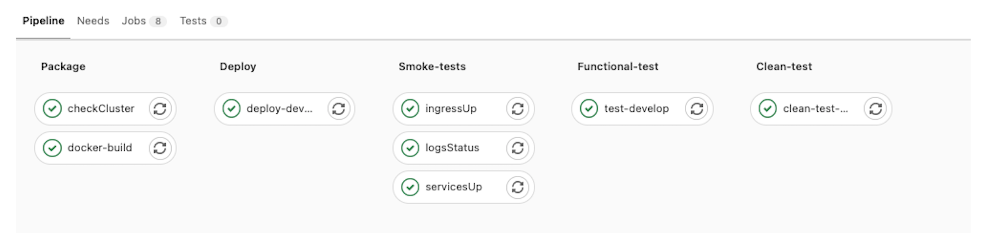

# 💨🔥💨 Smoke Master

#### ✅ Kubernetes, ✅ Automatic-test, ✅Smoke Test

Smoke Master is a service dedicated to conducting smoke testing on kubernetes pipelines. It does not require any configuration in the cluster. The service accesses the cluster by SSH performs the tests and then is automatically destroyed, which makes it totally secure.
The smoke tests focus on validating the stability of the cluster. It is highly recommended when combining multiple projects in a single kubernetes server.It can be run 100% from the gitlab pipeline.

## Library status:

| Type of Test                       | Status | Inputs Required | Command                                       |
| :--------------------------------- | :----- | :-------------- | :-------------------------------------------- |
| Check Logs Content                 | ✅     | 🤖 Automatic    | --check-pods-logs                             |
| Check Pods Status                  | ✅     | 🤖 Automatic    | --check-if-all-pods-are-active                |
| Check if Ingress are active        | ✅     | 🤖 Automatic    | --check-ingress                               |
| Check endpoint                     | ✅     | 🤖 Automatic    | --assert-curl                                 |
| Check volume                       | ✅     | 🤖 Automatic    | --check-volumes                               |
| Check networks                     | ❌     | 🤖 Automatic    | pending                                       |
| Check Publics Apis with Swagger    | ✅     | 👋 Manual       | --check-swagger-publics-apis                  |
| Check Swagger [GET]/Apis with Auth | ✅     | 👋 Manual       | --check-swagger-apis and --swagger-login-curl |
| Check dependencies                 | ❌     | 👋 Manual       | pending                                       |
| Add Smoke criterial                | ❌     | 🤖 Automatic    | pending                                       |

#### Example how to use the smoke-test structure inside of one pipeline:

It is recommended to use a first test to validate the conditions of the cluster as shown in the example with the step "checkCluster" This will check that the cluster is in proper conditions

The rest of the test cases can be applied right after the deployment of the service. This will help verify that the system is in proper condition before executing other types of tests.

## Smoke Master configuration options:

This section mentions the options related to general configuration services. You can use these commands to activate the test context or give you access to the services in your kubernetes cluster using SSH.
It is important to activate the rest of the test.

| Console command | Environment Variable | Environment Variable                                             |
| :-------------- | :------------------- | :--------------------------------------------------------------- |
| --context       | SMKTEST_CONTEXT      | Context of the test for example kubernetes, docker               |
| --environment   | SMKTEST_ENVIRONMENT  | Environment when the test is running example: localhost, develop |
| --project-name  | SMKTEST_PROJECT_NAME | Name of the project when the test go to running                  |
| --namespace     | SMKTEST_NAMPESPACE   | Namespace of the kubernetes node                                 |

## Table of Commands Smoke-Master:

These are the parameters to enable the different types of smoke tests

| Console command                | Environment Variable                 | Context    | Environment Variable                                                        |
| :----------------------------- | :----------------------------------- | :--------- | :-------------------------------------------------------------------------- |
| --check-endpoints              | SMKTEST_CHECK_INGRESS                | Kubernetes | Verify that the income is available and without errors                      |
| --check-if-all-pods-are-active | SMKTEST_CHECK_IF_ALL_PODS_ARE_ACTIVE | Kubernetes | Check if all pods are active                                                |
| --check-conditions             | SMKTEST_CHECK_CONDITIONS             | Kubernetes | Check cluster condition (MemoryPressure, PIDPressure)                       |
| --check-pods-logs              | SMKTEST_CHECK_PODS_LOGS              | Kubernetes | Check if exist logs error inside of Pods                                    |
| --assert-curl                  | SMKTEST_ASSERT_CURL                  | all        | Check respose using Curl petitions                                          |
| --check-ingress                | SMKTEST_CHECK_INGRESS                | Kubernetes | Check ingress and load balancer                                             |
| --check-volumes                | SMKTEST_CHECK_VOLUMES                | Kubernetes | Check that the available space is less than 80% percent                     |
| --check-swagger-publics-apis   | SMKTEST_CHECK_SWAGGER_PUBLICS_APIS   | all        | Check if exist 500 status response code in swagger apis                     |
| --check-swagger-apis           | SMKTEST_CHECK_SWAGGER_APIS           | all        | Check if exist 500 status response code in swagger apis with authentication |
| --swagger-login-curl           | SMKTEST_SWAGGER_LOGIN_CURL           | all        | Add the configuration parameters                                            |

## Connect test remote kubernetes cluster.

To connect the test to a remote cluster you must perform the following steps.

#### 1. Copy the cluster credentials in this format

Name of the variable of environment: KUBERNETES_TOKEN

apiVersion: v1
kind: Config
clusters:

- name: "serverName"
  cluster:
  server: "https://server-example"
  certificate-authority-data: "VGhlIEFkdmFuY2VkIEVuY3J5cHRpb24gU3RhbmRhcmQgKEFFUyksIGFsc28ga25vd24gYnkgaXRzIG9yaWdpbmFsIG5hbWUgUmlqbmRhZWwgKER1dGNoIHByb251bmNpYXRpb246IFvLiHLJm2luZGHLkGxdKSxbM10gaXMgYSBzcGVjaWZpY2F0aW9uIGZvciB0aGUgZW5jcnlwdGlvbiBvZiBlbGVjdHJvbmljIGRhdGEgZXN0YWJsaXNoZWQgYnkgdGhlIFUuUy4gTmF0aW9uYWwgSW5zdGl0dXRlIG9mIFN0YW5kYXJkcyBhb
- name: "serverName"
  cluster:
  server: "ServerExample"
  certificate-authority-data: "VGhlIEFkdmFuY2VkIEVuY3J5cHRpb24gU3RhbmRhcmQgKEFFUyksIGFsc28ga25vd24gYnkgaXRzIG9yaWdpbmFsIG5hbWUgUmlqbmRhZWwgKER1dGNoIHByb251bmNpYXRpb246IFvLiHLJm2luZGHLkGxdKSxbM10gaXMgYSBzcGVjaWZpY2F0aW9uIGZvciB0aGUgZW5jcnlwdGlvbiBvZiBlbGVjdHJvbmljIGRhdGEgZXN0YWJsaXNoZWQgYnkgdGhlIFUuUy4gTmF0aW9uYWwgSW5zdGl0dXRlIG9mIFN0YW5kYXJkcyBhb
  users: - name: "EXAMPLE"
  user:
  token: "TOKEN CLUSTER EXAMPLE"

contexts: - name: "USER NAME EXAMPLE"
context:
user: "USER_NAME"
cluster: CLUSTER_NAME

- name: "server example name"
  context:
  user: "name"
  cluster: "server example name"
  current-context: CONTEXTNAME

#### 2. Encode the data with Base of 64bits.

    Example of the Result

    DQogICAgYXBpVmVyc2lvbjogdjENCiAgICBraW5kOiBDb25maWcNCiAgICBjbHVzdGVyczoNCiAgICAtIG5hbWU6ICJzZXJ2ZXJOYW1lIg0KICAgIGNsdXN0ZXI6DQogICAgICAgIHNlcnZlcjogImh0dHBzOi8vc2VydmVyLWV4YW1wbGUiDQogICAgICAgIGNlcnRpZmljYXRlLWF1dGhvcml0eS1kYXRhOiAiVkdobElFRmtkbUZ1WTJWa0lFVnVZM0o1Y0hScGIyNGdVM1JoYm1SaGNtUWdLRUZGVXlrc0lHRnNjMjhnYTI1dmQyNGdZbmtnYVhSeklHOXlhV2RwYm1Gc0lHNWhiV1VnVW1scWJtUmhaV3dnS0VSMWRHTm9JSEJ5YjI1MWJtTnBZWFJwYjI0NklGdkxpSExKbTJsdVpHSExrR3hkS1N4Yk0xMGdhWE1nWVNCemNHVmphV1pwWTJGMGFXOXVJR1p2Y2lCMGFHVWdaVzVqY25sd2RHbHZiaUJ2WmlCbGJHVmpkSEp2Ym1saklHUmhkR0VnWlhOMFlXSnNhWE5vWldRZ1lua2dkR2hsSUZVdVV5NGdUbUYwYVc5dVlXd2dTVzV6ZEdsMGRYUmxJRzltSUZOMFlXNWtZWEprY3lCaGJtUWdWR1ZqYUc1dmJHOW5lU0FvVGtsVFZDa2dhVzRnTWpBd01TNWJORjBOQ2cwS1FVVlRJR2x6SUdFZ2MzVmljMlYwSUc5bUlIUm9aU0JTYVdwdVpHRmxiQ0JpYkc5amF5QmphWEJvWlhKYk0xMGdaR1YyWld4dmNHVmtJR0o1SUhSM2J5QkNaV3huYVdGdUlHTnllWEIwYjJkeVlYQm9aWEp6TENCV2FXNWpaVzUwSUZKcGFtMWxiaUJoYm1RZ1NtOWhiaUJFWVdWdFpXNHNJSGRvYnlCemRXSnRhWFIwWldRZ1lTQndjbTl3YjNOaGJGczFYU0IwYnlCT1NWTlVJR1IxY21sdVp5QjBhR1VnUVVWVElITmxiR1ZqZEdsdmJpQndjbTlqWlhOekxsczJYU0JTYVdwdVpHRmxiQ0JwY3lCaElHWmhiV2xzZVNCdlppQmphWEJvWlhKeklIZHBkR2dnWkdsbVptVnlaVzUwSUd0bGVTQmhibVFnWW14dlkyc2djMmw2WlhNdUlFWnZjaUJCUlZNc0lFNUpVMVFnYzJWc1pXTjBaV1FnZEdoeVpXVWdiV1Z0WW1WeWN5

3. Create one Environment variable with the name KUBERNETES_TOKEN and the last step results

## Check Ingress.

- Automatic Test: 🦾

This test validates that the ingress exposed in the cluster are active. The test consists of making a CURL request and verifying that they are operatively

#### Command Kubectl:

    kubectl get ingress --namespace=NAME_SPACE -o json

#### Command smoke-master:

    --check-ingress

#### Example:

    create-smktest --check-ingress=true

#### Gitlab Pipeline example:

#### Example how connect one remote cluster

    checkIngress:
    image:
        name: registry.gitlab.com/phdactivities/smoke-master:master
    stage: kubernetes
    variables:
        SMKTEST_PROJECT_NAME: 'SmokeMaster'
        SMKTEST_ENVIRONMENT: 'master'
        SMKTEST_CONTEXT: 'kubernetes'
        SMKTEST_NAMESPACE: 'nodespace'
        SMKTEST_MODE_AUTO: 'true'
    script:
        # Create cluster remote configuration file.
        - echo $KUBERNETES_TOKEN | base64 -d > /etc/deploy/config
        - create-smktest --check-ingress=true
    only:
        - master

## Check if all pods are Active:

- Automatic Test: 🦾

This test verifies that all pods are operational.

### Descriptions:

Verify if all Pods are running and are active

### Gitlab pipeline example:

    podsActive:
    image:
        name: registry.gitlab.com/phdactivities/smoke-master:master
    stage: kubernetes
    variables:
        SMKTEST_PROJECT_NAME: 'SmokeMaster'
        SMKTEST_ENVIRONMENT: 'master'
        SMKTEST_CONTEXT: 'kubernetes'
        SMKTEST_NAMESPACE: 'nodespace'
        SMKTEST_MODE_AUTO: 'true'
    script:
        # Create cluster remote configuration file.
        - echo $KUBERNETES_TOKEN | base64 -d > /etc/deploy/config
        - create-smktest --check-if-all-pods-are-active=true
    only:
        - master

## Check Conditions.

    * Automatic Test: 🦾

This command checks that those that do not exist alert in the cluster. These alerts can cause instability in all the nodes involved.

#### Command Kubectl:

    kubectl describe nodes

      Type             Status  LastHeartbeatTime                 LastTransitionTime                Reason                       Message
    ----             ------  -----------------                 ------------------                ------                       -------
    MemoryPressure   False   Wed, 16 Jun 2021 13:48:07 +0200   Thu, 26 Sep 2019 12:13:47 +0200   KubeletHasSufficientMemory   kubelet has sufficient memory available
    DiskPressure     False   Wed, 16 Jun 2021 13:48:07 +0200   Mon, 01 Mar 2021 18:01:45 +0100   KubeletHasNoDiskPressure     kubelet has no disk pressure
    PIDPressure      False   Wed, 16 Jun 2021 13:48:07 +0200   Thu, 26 Sep 2019 12:13:47 +0200   KubeletHasSufficientPID      kubelet has sufficient PID available
    Ready            True    Wed, 16 Jun 2021 13:48:07 +0200   Tue, 08 Jun 2021 14:12:12 +0200   KubeletReady                 kubelet is posting ready status

#### Command smoke-master:

    --check-conditions

#### Example:

    create-smktest --check-conditions=true

#### Gitlab Pipeline example:

    conditionsCluster:
    image:
        name: registry.gitlab.com/phdactivities/smoke-master:master
    stage: kubernetes
    variables:
        SMKTEST_PROJECT_NAME: 'SmokeMaster'
        SMKTEST_ENVIRONMENT: 'master'
        SMKTEST_CONTEXT: 'kubernetes'
        SMKTEST_NAMESPACE: 'nodespace'
        SMKTEST_MODE_AUTO: 'true'
    script:
        # Create cluster remote configuration file.
        - echo $KUBERNETES_TOKEN | base64 -d > /etc/deploy/config
        - create-smktest --check-conditions=true
    only:
        - master

## Check Logs Inside of the Pods.

#### Command Kubectl:

    kubectl logs ${name} --namespace=${namespace} --since=2m

#### Example:

    create-smktest --project-name=test --environment=develop --context=kubernetes --namespace=smokeMaster --mode-auto=true --check-pods-logs=true

#### Gitlab Pipeline example:

    logsPods:
    image:
        name: registry.gitlab.com/phdactivities/smoke-master:master
    stage: kubernetes
    variables:
        SMKTEST_PROJECT_NAME: 'SmokeMaster'
        SMKTEST_ENVIRONMENT: 'master'
        SMKTEST_CONTEXT: 'kubernetes'
        SMKTEST_NAMESPACE: 'edutelling-develop'
        SMKTEST_MODE_AUTO: 'true'
    script:
        # Create cluster remote configuration file.
        - echo $KUBERNETES_TOKEN | base64 -d > /etc/deploy/config
        - create-smktest --check-pods-logs=true
    only:
        - master

## Assert with CURL petitions.

- Input required: 💪

This test is based on CURL requests. They can be used to check if an api is available or a website. Example. It can be used to verify that the login page is enabled

#### Command smoke-master:

    --assert-curl="www.google.com"

#### Example:

    create-smktest --check-conditions=true

#### Gitlab pipeline

    checkLogin:
    <<: *smoke-test-curl
    variables:
        SMKTEST_ASSERT_CURL: 'curl -X POST "https://edutelling-api-develop.openshift.techgap.it/api/v1/auth/authentication" -H "accept: application/json" -H "Content-Type: application/json" -d "{ \"email\": \"formazione@edutelling.it\", \"password\": \"Passw0rd\", \"stayLogged\": false }"'
    script:
        - create-smktest --context=remote-server

## Check Volumes.

- Automatic Test: 🦾

This test verifies that the volume has free space

#### Command smoke-master:

    --check-volumes=true

#### Example:

    create-smktest --check-volumes=true

#### Gitlab pipeline

    volumeSpace:
    <<: *smoke-test-kubernetes
    script:
        - create-smktest --check-volumes=true
    only:
        - master

## Check publics apis using SWAGGER

This test automatically obtains the public apis that do not require parameters from the Swagger documentation. If any api returns a status of number 500 the test fails. It is designed to obtain instabilities in apis automatically.

#### Command smoke-master:

    --check-swagger-public-apis="https://petstore.swagger.io/v2/swagger.json"

#### Example:

    create-smktest --check-swagger-public-apis="https://petstore.swagger.io/v2/swagger.json"

#### Gitlab pipeline

    pubAPetStore:
    <<: *smoke-test-kubernetes
    stage: swagger
    script:
        - create-smktest --check-swagger-public-apis="https://petstore.swagger.io/v2/swagger.json"
    only:
        - master

## Check publics apis using SWAGGER with Authentication

This test obtains the list of apis [GET] that do not require parameters and makes a request to each one of the APIs using the authentication intended by the user in the form of CURL.

#### Command smoke-master:

    --check-swagger-apis=https://petstore.swagger.io/v2/swagger.json
    --swagger-login-curl=curl LOGIN WITH LOGIN ACCESS

#### Example:

    create-smktest --check-swagger-public-apis="https://petstore.swagger.io/v2/swagger.json" --swagger-login-curl=curl LOGIN WITH LOGIN ACCESS

## Build Image steps

    1. Login with:
        docker login --username $DOCKER_USER -p $DOCKER_TOKEN
    2. Build base imagen:
        docker build -t smktesting/smoke-master:latest -f Dockerfile .
    3. docker push smktesting/smoke-master:latest

## Build Image steps

    1. Login with:
        docker login --username $DOCKER_USER -p $DOCKER_TOKEN
    2. Build base imagen:
        docker build -t smktesting/smoke-master:latest -f Dockerfile .
    3. docker push smktesting/smoke-master:latest
